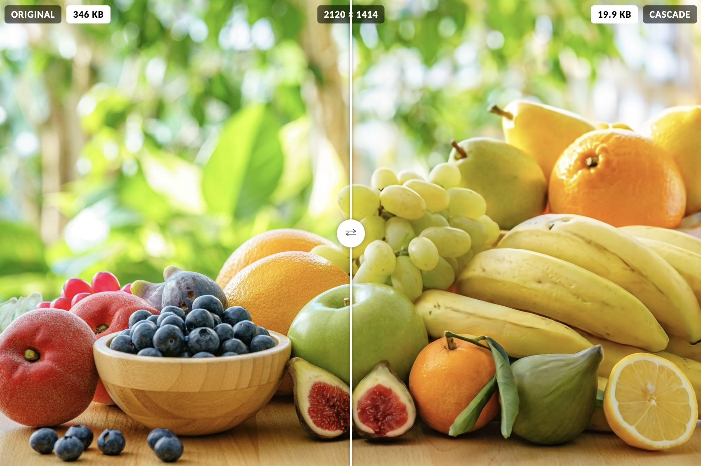

Cascade is a toy image codec trained on a relatively small dataset (1M images) focused on familiar objects and shapes. Most of the efficiency comes from general advancements in powerful generative image models (e.g. Gemini 3 Pro, SDXL) which do the heavy lifting. Cascade then leverages these pre-trained models during its own training to learn the input features that are most important to them to generate detailed and *faithful* reconstructions.

 

The codec uses three neural networks: a **vector quantized variational autoencoder** (VQ-VAE), a **cascading conditional convolutional network**, and a **pluggable generative image model** with a trained LoRA.

Like most perceptual codecs, Cascade learns the features of images that are most important for sharp, detailed, and faithful reconstruction. Where it differs is how it identifies, isolates, and stores these features. Cascade was created with the following objectives:

- **Faithfulness**: Compresses images while remaining faithful to style, color, and structure
- **Flexibility**: Supports arbitrary image resolutions with a continuous quality curve
- **Efficiency**: Delivers an average bitrate of **0.03** (range: **0.005** to **0.16**) on test images
- **Pluggable**: Supports almost all generative image-to-image models in the decoder

### Installation

1. Clone the source code from Github and [download the models from Hugging Face](https://huggingface.co/ramenhut/cascade/tree/main).

2. Place the models inside a /models folder within the source tree. 

3. Set `GEMINI_API_KEY` in the environment for the default Gemini decoder. The SDXL base auto-downloads from HuggingFace on first use (~7GB), and pip install -r requirements.txt covers the deps.

4. Encode an image.  This auto-selects the best guide (VQ-VAE vs AVIF/WebP), tags it with a caption/medium label, and writes the compressed .nit file.

    `python encode.py photo.jpg`

5. Decode a nit file. This reconstructs the image via medium-routed Gemini (the default decoder).

    `python decode.py photo.nit -o out.png`

### More Information

* [Related blog post](http://localhost:5173/blog/cascade-neural-image-compression)
* [Project page](http://localhost:5173/portfolio/artificial-intelligence/neural-image-compression)